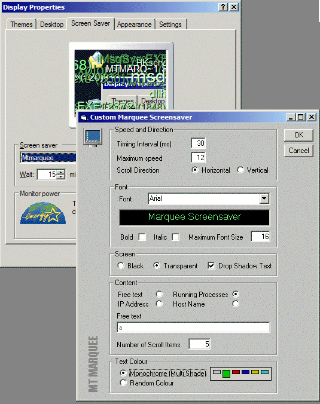



## Marquee screensaver grows up\!

### Description

The marquee screensaver is superb... but it doesn't do enough!! This version will display free format text like before, but also other things, like your machine name, ip address (no ocx!) or all your running tasks. Screens are good enough these days not to really require a comprehensively blanking screensaver, so I've added a transparent option too. There's lots of code here, all functionalised: Get IP address, Hostname, running processes, shrink screen to fit in Display properties window and bitblt of course. It seems a little cheaty, but I've allowed you to set the timer interval and maximum objects speed to tune to your own system. votes and comments always welcome. :-)
 
### More Info
 

             |
---                |---
**Submitted On**   |2003-07-14 13:59:56
**By**             |[Fosters](https://github.com/Planet-Source-Code/PSCIndex/blob/master/ByAuthor/fosters.md)
**Level**          |Intermediate
**User Rating**    |5.0 (30 globes from 6 users)
**Compatibility**  |VB 4\.0 \(32\-bit\), VB 5\.0, VB 6\.0
**Category**       |[Graphics](https://github.com/Planet-Source-Code/PSCIndex/blob/master/ByCategory/graphics__1-46.md)
**World**          |[Visual Basic](https://github.com/Planet-Source-Code/PSCIndex/blob/master/ByWorld/visual-basic.md)
**Archive File**   |[Marquee\_sc1614737152003\.zip](https://github.com/Planet-Source-Code/fosters-marquee-screensaver-grows-up__1-46921/archive/master.zip)

